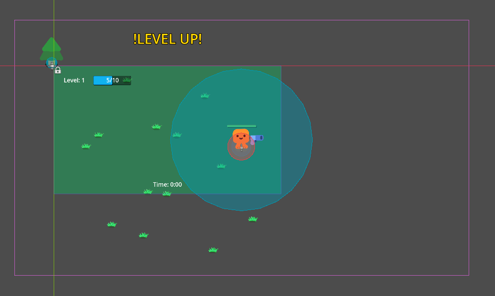

# Godot vampire survivors knockoff

### A learning project based off this [tutorial](https://www.youtube.com/watch?v=GwCiGixlqiU). No real direction but heavy inspiration from vampire survivors.

Current project direction is just feature creep the game, add whatever feature your heart desires but if your goal is to improve 
an already implemented system please keep the old system for learning purposes.

# Project Structure
```
├───addons
│   └───colorpicker_presetsoo
│       └───readme
├───Assets
├───Save_Data
├───Scenes
├───Scripts
└───Shaders
```